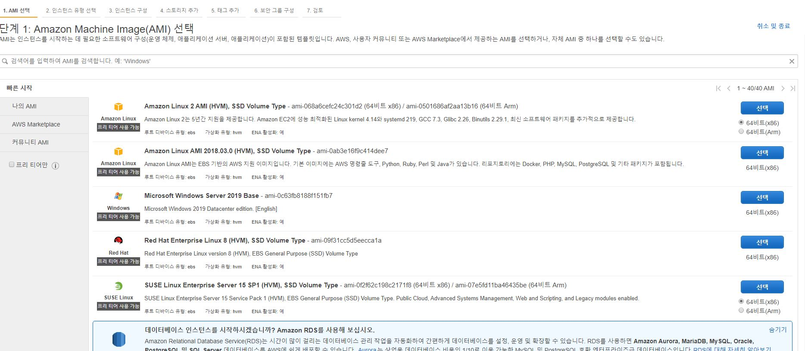
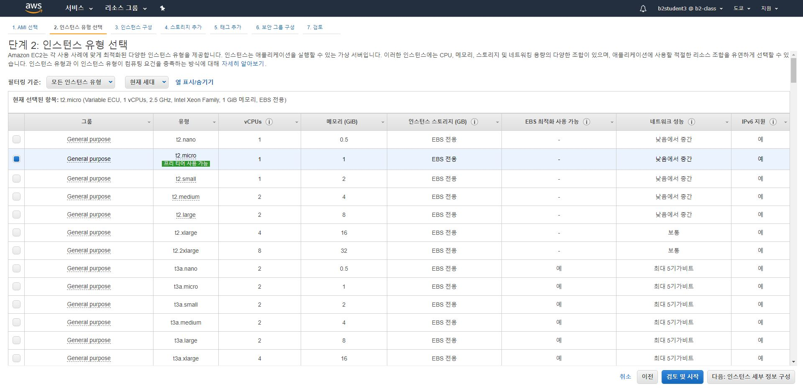
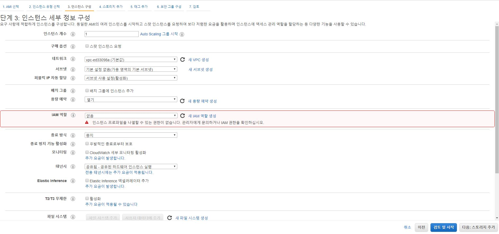
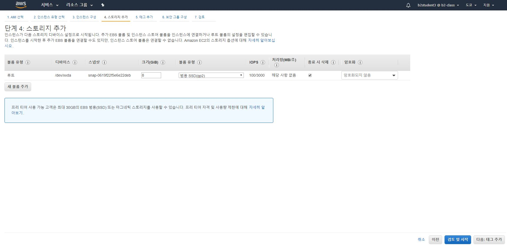
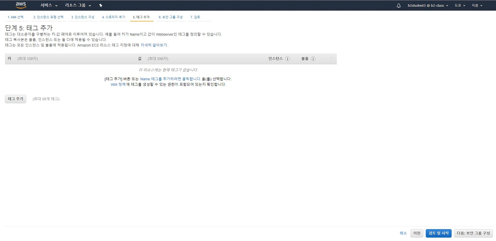

## 1. AWS Ec2 서버 만들기

  ### 1.1 AMI os 이미지 선택
  
  
  
  ### 1.2 인스턴스 사양 선택(cpu, 메모리, 가격 등)
  
  ### 1.3 인스턴스 세부 정보 구성
        - 인스턴스 개수, 네트워크 설정 등
        
  
  ### 1.4 스토리지 추가
  
  ### 1.5 태그 추가(옵션)
  
  ### 1.6 보안설정
         - ssh 접속 설정, 보안 그룹등
         - 키페어 생성 or 지정
         
  ### 1.7 끝!
  - 인스턴스 중지: 서버 끄기
  - 인스턴스 종료: 서버 제거(삭제)
  
## 2. Window 콘솔/터미널 창에서 서버 Ec2서버 접속하기
 
 ```
 $ ssh -i test.pem(PEM키 위치) ec2-user@IP주소
 ```
 ### 2.1 서버에 필요한 패키지 설치
 ```
 $ sudo yum update
 ```
 
## 3.PUTTY로 EC2서버에 접속하기
## 3.1 putty.exe, puttygen.exe 다운로드
### 3.2 puttygen.exe 실행해서 .pem파일 ppk로 변환
### 3.3 putty.exe > session 연결
- hostname:  ec2-user@IP주소
- port: 22
- SSH => AUTH => Browse => ppk파일 업로드
=>OPEN

## 4. 리눅스 명령어
```
$ df -s >>디스크 확인
$ free -h >>메모리 확인
```


## 5. express로 node.js 프로젝트 만들기

### 5.1 git, node.js,  설치
```
$ sudo yum install -y git

$ sudo yum install -y gcc-c++ make
$ curl -sL https://rpm.nodesource.com/setup_8.x | sudo -E bash -
$ sudo yum install nodejs

$ npm install -g express-generator
```
### 5.2 git에서 DAY2실습에서 만든 레포지토리 다운

